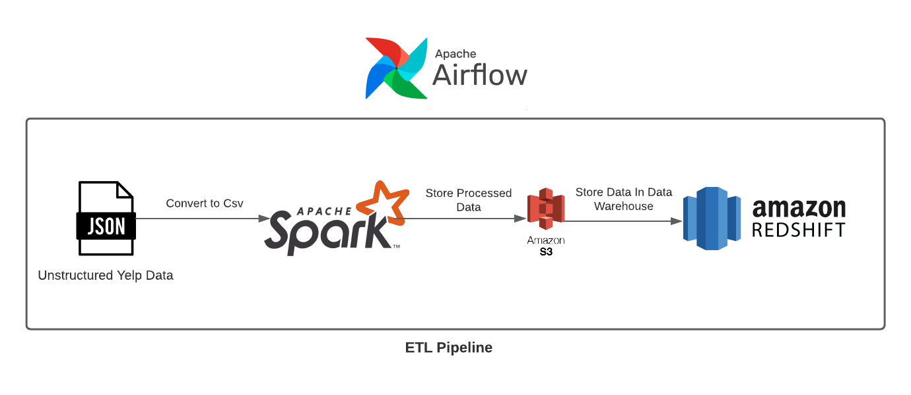
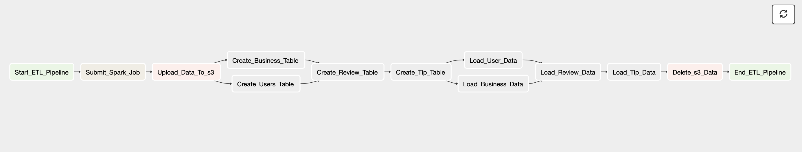
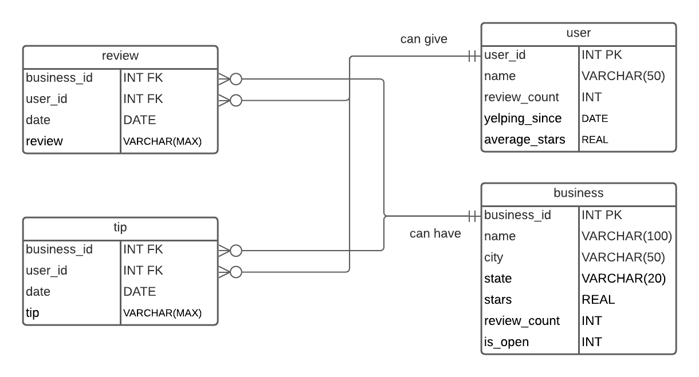

# YELP ETL PIPELINE

## INTRODUCTION

The etl pipeline transforms the unstructured json data into structured csv files using Apache Spark and uploads them to Amazon S3. The csv files from s3 are then inserted into the Data Warehouse created and hosted on Amazon Redshift. Once the data is inserted into the warehouse, the csv files are then deleted from s3. 

## PIPELINE ARCHITECTURE

## AIRFLOW TASK SEQUENCE

## DATA WAREHOUSE ARCHITECTURE

## DATA

The data used for the project comes from Yelp. It can be downloaded by following this link: https://www.yelp.com/dataset . The json files are to be placed under data folder in dags directory while the processed data is temporary saved in clean folder under dags directory. 

## FILE INFORMATION

[etl_pipeline.py](dags/etl_pipeline.py) in the dags folder is the dag file containing list of all the tasks necessary for the pipeline. [sql_script.py](dags/scripts/sql/sql_script.py) under the sql folder in dags directory contains all the sql commands to create the tables. [spark_jobs.py](dags/scripts/spark/spark_jobs.py) under the spark folder in dags directory contains all code to process json into structured data.

